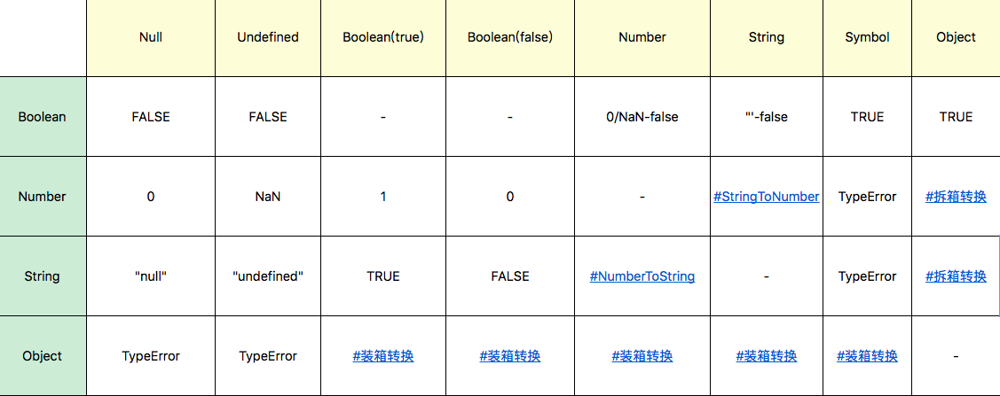
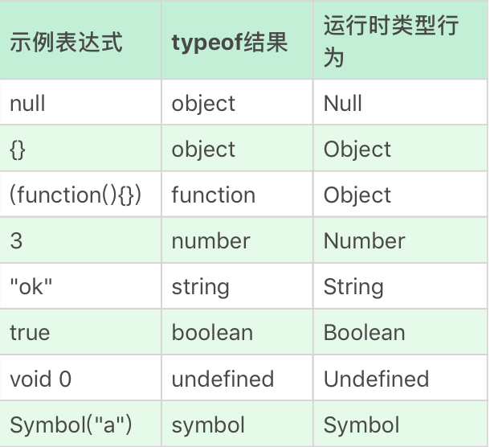

+ <u>为什么有的编程规范要求用 void 0 代替 undefined?</u>
+ <u>字符串有最大长度吗?</u>
+ <u>javascript中 0.1 + 0.2 为什么不等于 0.3?</u>
+ <u>为什么给对象添加的方法能用在基本类型上</u>


# 运行时角度看 JavaScript 类型系统 

+ 运行时类型是**代码实际执行过程中**我们用到的类型. 
+ 所有的类型数据都会属于**7个类型之一**. 
+ 从变量, 参数, 返回值到表达式中间结果, 任何 Javascript 代码运行过程中产生的数据, 都具有运行时类型

## 类型

1. **Undefined**
2. **Null**
3. **Boolean**
4. **String**
5. **Number**
6. **Symbol (ES6)**
7. **Object**

### Undefined, Null

+ Undefined 类型表示未定义, 他的类型只有一个值, 就是undefined. 
+ 任何变量在赋值前是 Undefined 类型, 值为undefined.
+ 一般我们可以用全局变量 undefined 来表达这个值


+ 但是因为Javascript的代码 **undefined 是一个变量, 而并非是一个关键字**, 这是Javascript语言公认的设计失误之一.
+ 为了避免无意中被篡改, 建议用 void 0 来获取 undefined 值
+ 在现代浏览器（JavaScript 1.8.5/Firefox 4+），自ECMAscript5标准以来undefined是一个不能被配置（non-configurable），不能被重写（non-writable）的属性。即便事实并非如此，也要避免去重写它。


+ Null 类型也只有一个值, 就是 null, 它的语义表示空值.
+ 与 undefined 不同, **null 是 Javascript 关键字, 在任何代码中都可以放心用 null 关键字来获取 null 值**


### Boolean

+ Boolean 类型有两个值, true 和 false 
+ 用于表示逻辑意义上的真和假, 同样有关键字 true 和 false 表示两个值


### String

+ String 用于表示文本数据, <u>String 有最大长度是 2 ^ 53 - 1</u>, 在一般开发中足够使用, 但这个最大长度并不完全是理解中的字符数

+ **String的意义并非 "字符串"**, 而是字符串的 **UTF16编码**, 我们字符串的操作 charAt, charCodeAt, length 等方法针对的都是 UTF16 编码. 所以, **字符串的最大长度, 实际上是受字符串编码长度影响的**

  ```text
  Note：现行的字符集国际标准，字符是以 Unicode 的方式表示的，每一个 Unicode 的码点表示一个字符，理论上，Unicode 的范围是无限的。UTF 是 Unicode 的编码方式，规定了码点在计算机中的表示方法，常见的有 UTF16 和 UTF8。 Unicode 的码点通常用 U+??? 来表示，其中 ??? 是十六进制的码点值。 0-65536（U+0000 - U+FFFF）的码点被称为基本字符区域（BMP）。
  ```

+ Javascript 中的<u>字符串是永远无法变更的, 一旦字符串构造出来, 无法用任何方式改变字符串的内容</u>, 所以字符串具有值类型的特征

+ Javascript 字符串吧每个 UTF16 单元当作一个字符来处理, <u>处理非BMP(超出 U+0000 - U+FFFF范围)的字符时应小心</u>


### Number

+ Javascript中的Number类型有 18437736874454810627(即 2^64-2^53+3) 个值。
+ JavaScript 中的 Number 类型基本符合 IEEE 754-2008 规定的双精度浮点数规则，但是 JavaScript 为了表达几个额外的语言场景（比如不让除以 0 出错，而引入了无穷大的概念）规定了几个例外情况: 
  + NaN，占用了 9007199254740990，这原本是符合 IEEE 规则的数字；
  + Infinity，无穷大；
  + -Infinity，负无穷大。

+ JavaScript 中有 **+0 和 -0**，在加法类运算中它们没有区别，但是除法的场合则需要特别留意区分，“忘记检测除以 -0，而得到负无穷大”的情况经常会导致错误，而区分 +0 和 -0 的方式，正是**检测 1/x 是 Infinity 还是 -Infinity**。

+ 根据双精度浮点数的定义，Number 类型中有效的整数范围是 -0x1fffffffffffff 至 0x1fffffffffffff，所以 Number 无法精确表示此范围外的整数

+ 同样根据浮点数的定义，非整数的 Number 类型无法用 ==（=== 也不行） 来比较，一段著名的代码，这也正是我们第三题的问题，为什么在 JavaScript 中，0.1+0.2 不能 = 0.3：

+ 浮点数运算的精度问题导致等式左右的结果并不是严格相等，而是**相差了个微小的值**。

  + 正确的比较方法是使用 JavaScript 提供的最小精度值：

    ```javascript
    console.log( Math.abs(0.1 + 0.2 - 0.3) <= Number.EPSILON);
    ```


### Symbol

+ Symbol 是 ES6 中引入的新类型, **是一切非字符串对象key的集合**, 在ES6规范中, 整个对象系统被用Symbol重塑

+ Symbol 可以具有字符串类型的描述, 但即使是描述相同, Symbol 也不相等

+ 一些标准中提到的Symbol, 可以在全局的Symbol属性中找到. 例如可以使用Symbol.iterator 来自定义 for...of在对象上的行为

  ```JavaScript
      var o = new Object
  
      o[Symbol.iterator] = function() {
          var v = 0
          return {
              next: function() {
                  return { value: v++, done: v > 10 }
              }
          }        
      };
  
      for(var v of o) 
          console.log(v); // 0 1 2 3 ... 9
  ```


### Object

+ Object 是 Javascript 中最复杂的类型, 也是 Javascript 的核心机制之一. 

+ Object 表示对象的意思, 他是一切有形和无形物体的总称

+ <u>为什么给对象添加的方法能用在基本类型上</u>

  + 在 Javascript 中, 对象的定义是 "属性的集合".

    + 属性分为数据属性和访问器属性, 二者都是 key-value结构, key可以是字符串或者Symbol类型

  + Javascript中的 "类" 仅仅是运行时对象的一个私有属性, 而 **Javascript 中是无法自定义类型**的.

  + Javascript中的几个基本类型都在对象类型中有一个 "亲戚" (**包装类**): <u>Number, String, Boolean , Symbol</u>

    + 3 与 new Number(3) 是完全不同的值, 它们一个是 Number 类型, 一个是对象类型 

  + **Number, String, Boolean**, 三个构造器是两用的, 跟 new 搭配时, 他们**产生对象**, 直接调用时, 他们表示**强制类型转换**

  + **Symbol** 函数比较特殊, 直接用 new 调用会抛出错误, 但它仍然是 Symbol 对象的构造器

  + <u>Javascript 语言设计上试图模糊对象和基本类型之间的关系</u>, 

    + 可以把对象的方法在基本类型上使用

      ```javascript
      console.log("abc".charAt(0)); //a
      ```

    + 在原型上添加方法, 可以应用于基本类型

      ```javascript
      Symbol.prototype.hello = () => console.log("hello");
      
      var a = Symbol("a");
      console.log(typeof a); //symbol，a并非对象
      a.hello(); //hello，有效
      ```

  + 答案: <u>运算符提供了装箱操作, 它会根据基础类型构造一个临时对象, 使得我们能在基础类型上调用对象的方法</u>


### 类型转换

+ JS是弱类型语言, 大部分我们熟悉的运算都会先进行类型转换

  


#### StringToNumber

+ 字符串到数字的类型转换, 存在一个语法结构, 支持 十进制, 二进制, 八进制, 十六进制
  + 30
  + ob111
  + 0o13
  + 0xFF

+ Javascript 支持的字符串语法还包括正负号科学计数法, 可以使用大写或小写e表示
  + 1e3
  + -1e-2
+ <u>paresInt 和 parseFloat 并不使用这个转换</u> 
  + 在**不传入第二参数**时, <u>parseInt 只支持16进制前缀 '0x', 并且会忽略非数字字符, 也不支持科学计数法</u>
  + 在一些**古老浏览器**中, <u>parseInt 同时支持0开头的数字作为8进制前缀</u>, 所以在任何环境下都<u>建议传入 parseInt 的第二个参数</u>
  + **parseFloat直接把原字符作为十进制解析**, 不会引入其他进制
  + 多数情况下，**Number** 是比 parseInt 和 parseFloat 更好的选择


#### NumberToString

+ 在较小的范围内, 数字到字符串的转换 完全符合十进制表示
+ 当Number绝对值较大或较小时, 字符串表示则是使用科学计数法表示(保证了产生的字符串过长) 


#### 装箱转换

+ 每一种基本类型 Number, String, Boolean, Symbol 在对象中都有对应的类
+ **装箱转换**: <u>把基本类型转换为对应的对象, 它是类型转换中一种相当重要的种类</u>

+ 全局的Symbol函数无法使用new来调用, 但我们仍可以利用装箱机制来得到一个Symbol对象, <u>我们可以利用一个函数 call 方法来强迫产生装箱</u>

  ```javascript
  var symbolObject = (function(){ return this; }).call(Symbol("a"));
  
  console.log(typeof symbolObject); //object
  console.log(symbolObject instanceof Symbol); //true
  console.log(symbolObject.constructor == Symbol); //true
  ```

+ 每一类装箱对象皆有私有的Class属性, 这些属性可以用 Object.prototype.toString 获取: 

  ```JavaScript
  var symbolObject = Object(Symbol("a"));
  
  console.log(Object.prototype.toString.call(symbolObject)); //[object Symbol]
  ```

+ 在 Javascript 中, **没有任何方法可以更改私有的Class属性**, 因此 Object.prototype.toString 是可以准确识别对象对应的基本类型的方法, 比 instanceof 更加准确
+ 要注意的是, **call本身会产生装箱操作**, 要配合 typeof 来区分基本类型还是对象类型


#### 拆箱转换

+ 在 Javascript 标准中, 规定了 ToPrimitive 函数, <u>它是对象类型到基本类型的转换(即: 拆箱转换)</u>
+ 对象到 String 和 Number 的转换都遵循 "先拆箱再转换" 的规则. 通过拆箱转换, <u>把对象变成基本类型, 再从基本类型转换为对应的 String 或者 Number</u>
+ 拆箱转换会尝试调用 **valueOf 和 toString** 来获得拆箱后的基本类型, 如果 valueOf 和 toString 都不存在, 或者没有返回基本类型, 则会产生类型错误 TypeError

```javascript
var o = {
    valueOf : () => {console.log("valueOf"); return {}},
    toString : () => {console.log("toString"); return {}}
}

o * 2
// valueOf
// toString
// TypeError
```


+ 到 String 的拆箱转换会优先调用 toString. 我们把刚才的运算从 o * 2 换成 String(o): 

```javascript
var o = {
    valueOf : () => {console.log("valueOf"); return {}},
    toString : () => {console.log("toString"); return {}}
}

String(o)
// toString
// valueOf
// TypeError
```


+ 在 ES6 之后, 还允许对象通过显示指定 @@toPrimitive Symbol 来覆盖原有的行为

```javascript
var o = {
    valueOf : () => {console.log("valueOf"); return {}},
    toString : () => {console.log("toString"); return {}}
}

o[Symbol.toPrimitive] = () => {console.log("toPrimitive"); return "hello"}


console.log(o + "")
// toPrimitive
// hello
```


### 结束

除了这七种语言类型，还有一些语言的实现者更关心的规范类型。

+ List 和 Record： 用于描述函数传参过程。Set：主要用于解释字符集等。
+ Completion Record：用于描述异常、跳出等语句执行过程。
+ Reference：用于描述对象属性访问、delete 等。
+ Property Descriptor：用于描述对象的属性。
+ Lexical Environment 和 Environment Record：用于描述变量和作用域。
+ Data Block：用于描述二进制数据。


### 补充

+ typeof 运算对照




